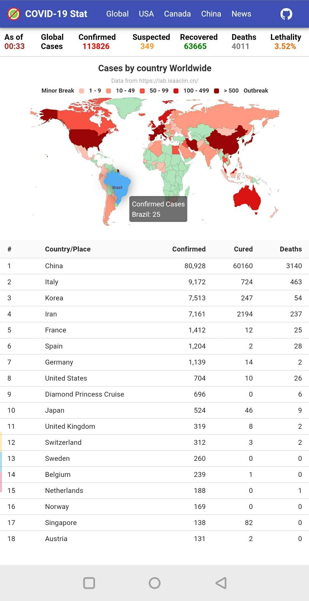
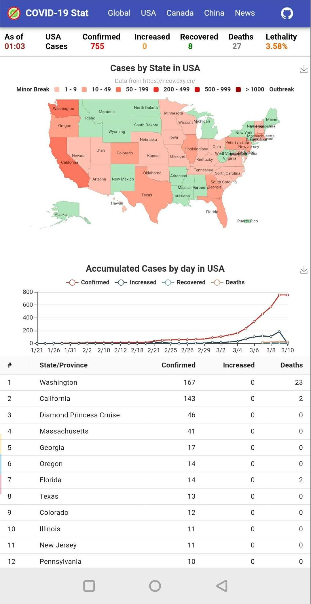
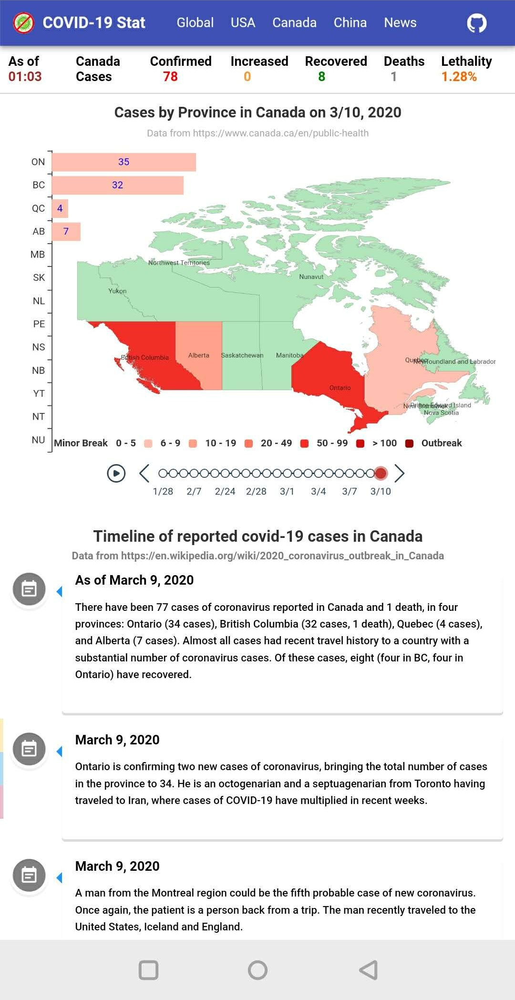
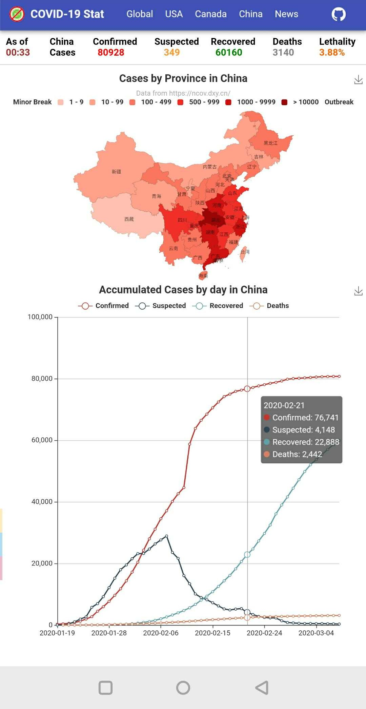

## Introduction
A web app uses react, material ui, echarts, and js scraper to collect and represent statistics of coronavirus in the world.
- Latest host on AWS EC2: https://covid19-stat.site/ (update every 10 minutes)
- New Hosting on AWS S3: http://covid-19-statistics.s3-website-us-west-2.amazonaws.com/ (update every 2 hours by github actions)
- Original Hosting on heroku: https://covid-19-statistics.herokuapp.com/ (update every hour by github actions))

Note: 
- The heroku site may not be accessible because it's sleeping when it's idle, just give a second visit after 2-3 minutes and it will be awaken.

## Collected Data Source (Auto-update every hour)
### Epidemic data for downloading
  - Latest cases numbers are collected/scraped periodically and written into JSON files in [assets](https://github.com/denven/covid-19-statistics/tree/master/public/assets) directory.

- Thanks to:
  - https://lab.isaaclin.cn/nCoV/en
  - https://en.wikipedia.org/wiki/2020_coronavirus_outbreak_in_Canada
  - https://www.canada.ca/en/public-health/services/diseases/2019-novel-coronavirus-infection.html
  - https://www.worldometers.info/coronavirus/

## Screenshots
### Desktop View

### Mobile View

Global Statistics           |  USA Statistics            |  Canada Statistics
:-------------------------:|:-------------------------:|:-------------------------:
  | |

China Statistics           |  Latest News          | |
:-------------------------:|:-------------------------:|:-------------------------:  
    |  |

 |

